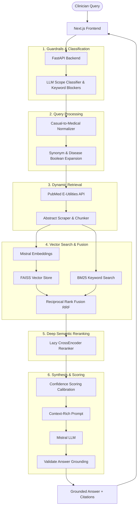

# 🩺 Jubilant AI: Medical Research Assistant

An AI-powered medical research assistant designed for clinicians and researchers. It provides evidence-grounded answers by combining real-time **PubMed** literature retrieval with a custom **Retrieval-Augmented Generation (RAG)** pipeline.

> **⚠️ Disclaimer:** This tool is for research support only. It is not intended for emergency care, clinical diagnosis, or personal treatment decisions.

**Live Demo:** [https://medi-chat-an1i.vercel.app/](https://medi-chat-an1i.vercel.app/)

---

## 🏗️ System Architecture

The application is structured around a modular RAG pipeline that balances speed, cost, and memory efficiency:



---

## 🚀 Key Features & Detailed Pipeline Explanation

### 1. Medical Scope Classification & Safety Guardrails
- **Emergency Keywords**: Fast regex checks block high-risk terms (e.g., "suicide", "stroke symptoms", "heart attack") and prompt the user to seek immediate emergency care.
- **LLM Scope Classifier**: Incoming queries are processed by a Mistral scope classifier to categorize them into:
  - `GREETING`: Greetings or general assistant information.
  - `MEDICAL_IN_SCOPE`: Scientific, clinical, and conceptual questions.
  - `PATIENT_SPECIFIC`: Personal diagnostic or treatment questions. These are allowed but returned with an auto-appended patient disclaimer.
  - `NON_MEDICAL`: General questions (e.g., weather, stocks). These are refused with a polite out-of-scope notice.

### 2. Query Preprocessing & Boolean Expansion
- **Casual-to-Medical Normalization**: Converts casual health vocabulary to standard clinical terminology (e.g., `"kidney pain"` ➔ `"nephropathy"`, `"high sugar"` ➔ `"hyperglycemia"`).
- **Boolean Expansion**: Automatically pulls synonym groups and joins them using Boolean operators (e.g., `(hyperglycemia OR "high sugar" OR "high glucose")`) to maximize PubMed search coverage.

### 3. Dynamic PubMed Retrieval & Smart Simplification
- **Progressive PubMed Search**: PubMed search is executed using E-utilities. If a long, complex clinical query is submitted, strict filters may fail. The system tries progressively broader strategies:
  1. Strict expanded Boolean query combined with publication types (systematic reviews, meta-analyses, RCTs).
  2. Raw expanded Boolean query.
  3. Cleaned, keyword-only fallback query.
- **Keyword Truncation Protection**: The fallback query ignores general stop words (including prepositions like `"of"`) and clinical search fillers (e.g., `compare`, `efficacy`, `versus`, `treating`). This prevents core medical concepts (such as drug names or specific conditions) from being truncated when the query exceeds PubMed's keyword budget.

### 4. Sparse/Dense Hybrid Search & RRF
- **Embedding Generation**: Abstracts from retrieved papers are split into overlapping chunks and vectorized using Mistral embeddings (`mistral-embed`).
- **Reciprocal Rank Fusion (RRF)**: Merges sparse keyword scores (BM25) with dense semantic similarity scores (FAISS IndexFlatIP) to produce a unified, robust ranking of candidate chunks.

### 5. Memory-Optimized Deep Semantic Reranking
- **Cross-Encoder Model**: Restores the high-accuracy `cross-encoder/ms-marco-MiniLM-L-6-v2` model to evaluate the deep semantic relationship between the query and candidate abstracts.
- **Lazy Loading**: The model is only loaded into RAM when a query requires reranking, keeping server startup fast.
- **RAM Safety Guards**: Using `psutil`, the system monitors local RAM percent usage. If memory usage exceeds `95%` (configurable), the reranker is safely skipped, falling back to FAISS/BM25 scores to prevent Out-Of-Memory (OOM) crashes on constrained environments like Render's free 512MB tier.

### 6. Confidence Calibration & Answer Grounding
- **Confidence Calibration**: Embeddings cosine similarity scores (compressed in the high `0.65` to `0.95` range) are mapped to a linear `0.0` to `1.0` scale.
- **Trusted Journals Boost**: Boosts confidence scores when articles are from reputable medical journals (e.g., *BMJ*, *Lancet*, *NEJM*, *JAMA*).
- **Strict Evidence Calibration**: If PubMed returns 0 results for a query, the confidence score drops strictly to `0.0` and the system returns a safe, standardized fallback message: *"Limited direct evidence found; related literature suggests possible associations."*
- **Fact Grounding Guard**: Checks generated answers against the source abstracts to ensure no hallucinations.

### 7. Conversational PICO Preprocessing & Calibrated RAG Scoring
- **PICO Preprocessing**: Translates conversational, patient-specific health queries (e.g. *"i am 45 years old, i am having high bp and heart rate"*) dynamically into clean clinical search keywords (e.g. `hypertension tachycardia`) using the PICO (Patient, Intervention, Comparison, Outcome) framework.
- **Generic Clinical Noise Filters**: Automatically filters out demographic noise (like age, gender, e.g. `'45 years old'`, `'middle aged adult'`) and generic clinical words (`management`, `treatment`, `etiology`, `cause`, `symptoms`, `signs`) from the simplified search query. This prevents PubMed searches from being overly restricted.
- **Tachycardia Synonyms Mapping**: Maps colloquial heart rate indicators (e.g., `"heart rate"`, `"high heart rate"`, `"fast heart rate"`) to standard MeSH `tachycardia` and expands it into standard Boolean synonym terms: `(tachycardia OR "high heart rate" OR "elevated heart rate" OR "heart rate" OR "fast heart rate")`.
- **Decoupled Sufficiency Checker**: Evaluates sufficiency using `settings.min_relevance_score` (default `0.35`) instead of a hardcoded `0.78` and sets `min_papers=1` to allow synthesis when a single highly relevant paper matches.
- **Relevance-Check Bypassing**: When using the strict LLM batch relevance checker, any paper approved by the LLM bypasses the raw similarity floor check, ensuring valid literature is synthesized.
- **Continuous Score Calibration**: Reranker scores below `0.08` scale down smoothly and linearly rather than collapsing to raw values, stabilizing clinician-facing confidence ratings.

---

## 🛠️ Project Structure

```text
jubilant_ai/
├── frontend/             # Next.js UI
│   ├── src/app/          # App layouts, style themes, and page routing
│   ├── src/components/   # Presentational UI components (Chat interface, cards)
│   │   └── chat/         # Custom ResponseCard & StructuredAnswer layouts
│   └── src/lib/          # API models and client wrappers
├── backend/              # FastAPI Application
│   ├── app/              # Router, rate limits, and configurations
│   ├── rag/              # Vector store, scoring, RAG pipelines, and normalizers
│   ├── services/         # PubMed API, embeddings, and CrossEncoder reranker
│   ├── models/           # Pydantic validation schemas
│   └── scratch/          # Integration, API, and bug verification scripts
└── docs/                 # Documentation and sample queries
```

---

## 🚦 Configuration & Local Setup

### Environment Variables (.env)

Create a `backend/.env` file with the following variables:

```ini
# Mistral AI (Required for embeddings, classification, and generation)
MISTRAL_API_KEY=your_mistral_api_key_here
MISTRAL_MODEL=mistral-large-latest

# PubMed & Retrieval Controls
PUBMED_MAX_RESULTS=15
PUBMED_RETRIEVAL_TOP_K=8
MIN_RELEVANCE_SCORE=0.35
MIN_EVIDENCE_CHUNKS=2

# Server Configuration
API_HOST=127.0.0.1
API_PORT=8080
CORS_ORIGINS=http://localhost:3000

# Rate Limiting
RATE_LIMIT_PER_MINUTE=20

# Medical Safety
BLOCK_EMERGENCY_KEYWORDS=true
MIN_CONFIDENCE_THRESHOLD=0.4
```

### 1. Backend Setup (FastAPI)
```bash
cd backend
python -m venv .venv

# Activate Virtual Env (Windows PowerShell)
.venv\Scripts\activate

# Install Dependencies (includes CPU-only PyTorch for reranker)
pip install -r requirements.txt

# Run the API server
$env:PYTHONPATH="."
uvicorn app.main:app --reload --host 127.0.0.1 --port 8080
```
*Backend API docs will be active at [http://127.0.0.1:8080/docs](http://127.0.0.1:8080/docs)*

### 2. Frontend Setup (Next.js)
```bash
cd frontend
npm install

# Configure local env
cp .env.example .env.local
# Make sure NEXT_PUBLIC_API_URL=http://localhost:8080

# Run Next.js in development mode
npm run dev
```
*Frontend interface will be active at [http://localhost:3000](http://localhost:3000)*

---

## 🛡️ Production Deployment (e.g., Render)

The backend is configured to support memory constraints out-of-the-box:
1. **Dynamic Reranking**: If deployed on a Render free tier containing only `512MB` of RAM, the system will detect that memory usage exceeds the safety threshold (`95%`) and bypass the heavy Cross-Encoder execution, ensuring high availability and zero OOM crashes.
2. **Docker Setup**: A `Dockerfile` is provided in both backend and frontend directories for containerized hosting.
3. **CORS / Domain Security**: Ensure `CORS_ORIGINS` in your production environment variables points exactly to your frontend domain.
