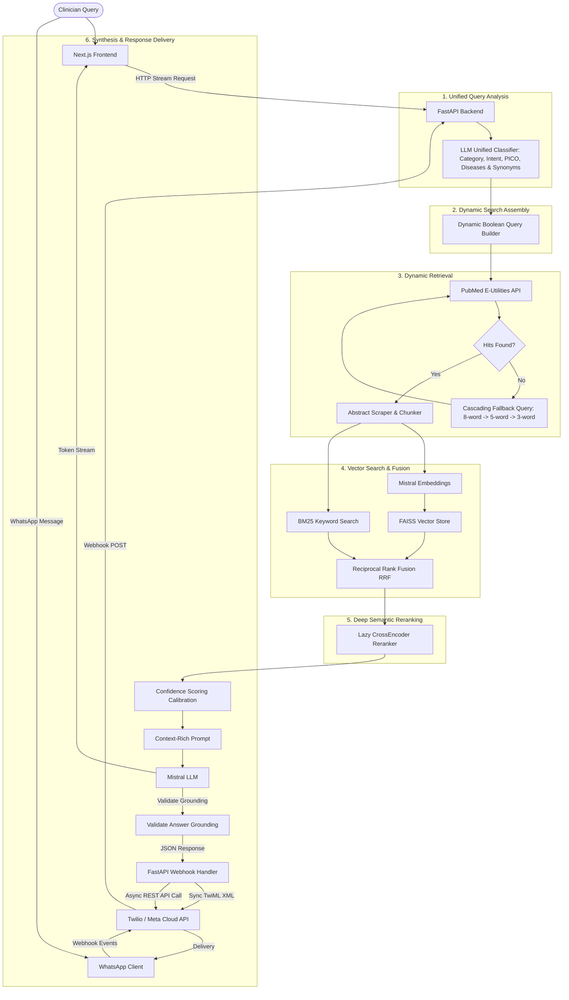

# 🩺 Jubilant AI: Medical Research Assistant


An AI-powered medical research assistant designed for clinicians and researchers. It provides evidence-grounded answers by combining real-time **PubMed** literature retrieval with a custom **Retrieval-Augmented Generation (RAG)** pipeline.

### 📱 Dual-Interface Support
Clinicians can interact with the assistant through two fully integrated interfaces, both powered by the same backend RAG engine:
1. **Interactive Next.js Web App**: Features full markdown rendering, SSE real-time streaming, and interactive citation cards.
2. **WhatsApp Chatbot**: Integrated via Twilio or Meta Business API. Clinicians can query the RAG pipeline on-the-go with mobile-optimized formatting, dynamic note pruning, and guaranteed citation preservation under the 1,600-character mobile limit.

> **⚠️ Disclaimer:** This tool is for research support only. It is not intended for emergency care, clinical diagnosis, or personal treatment decisions.

**Live Demo:** [https://medi-chat-an1i.vercel.app/](https://medi-chat-an1i.vercel.app/)

> [!WARNING]
> **Free-Tier Reranker Limitation**: The live demo is hosted on a resource-constrained free cloud tier. To avoid Out-of-Memory crashes, the deep semantic **Cross-Encoder reranking model is disabled** in the live demo, which may reduce the accuracy of multi-concept queries. For full accuracy and the complete RAG experience, **running the app locally is recommended**.

---

## 🏗️ System Architecture

The application is structured around a modular RAG pipeline that balances speed, cost, and memory efficiency:



---

## 🚀 Key Features & Detailed Pipeline Explanation

### 1. Unified Query Analysis & Safety Classifier
- **Dynamic LLM Analyzer**: All safety checks and intent classifications are delegated fully to the Mistral AI query analyzer, eliminating fragile regex-based pre-filtering or overrides. It dynamically analyzes:
  - `category`: Classifies into `GREETING`, `MEDICAL_IN_SCOPE`, `PATIENT_SPECIFIC` (allowed with patient disclaimers), or `NON_MEDICAL` (blocked).
  - `is_emergency`: Flags immediate, acute life-threatening situations (e.g. cardiac arrest, active chest pain, suicide risk). Sub-acute symptoms (e.g., three-day headache, blurry vision, high blood pressure) are permitted to enable clinical research checks.
  - `is_high_risk`: Identifies proposals to stop vital treatments (e.g., stop insulin or replace chemotherapy).
  - `clinical_focus`: Categorizes question intent into `treatment`, `diagnosis`, `mechanism_of_action`, `prognosis`, or `general`.
  - `pico_analysis` & `simplified_search_query`: Generates clinically normalized keywords, removing conversational filler, demographics (age/gender), and generic verbs.
  - `inferred_diseases` & `synonym_expansion`: Performs clinical reasoning to output inferred underlying conditions and dynamic, concept-specific synonym lists.

### 2. Dynamic Synonym & Disease Boolean Expansion
- **Dynamic Synonym Mapping**: Eliminates all hardcoded translation dictionaries. Synonym lists are generated dynamically by the LLM based on its medical knowledge.
- **Smart Boolean Expansion**: Programmatically constructs the PubMed query. The concepts are combined with `AND`, and synonyms are grouped with `OR`.
- **Differential Disease OR Grouping**: Inferred diseases are grouped under a single `OR` clause (e.g., `AND ("Pheochromocytoma" OR "Hyperthyroidism" OR "Anxiety")`) instead of separate `AND` clauses. This prevents the search query from becoming overly restrictive and ensures PubMed returns valid matching literature.

### 3. Dynamic PubMed Retrieval & Smart Simplification
- **Progressive PubMed Search**: PubMed search is executed using E-utilities. If a long, complex clinical query is submitted, strict filters may fail. The system tries progressively broader strategies:
  1. Strict expanded Boolean query combined with publication types (systematic reviews, meta-analyses, RCTs).
  2. Raw expanded Boolean query.
  3. Cleaned, keyword-only fallback query (up to 8 keywords).
  4. **Cascading Keyword Fallbacks**: If the full fallback query still returns 0 hits from PubMed due to word density, the system dynamically cascades to a subset containing the first 5 keywords, and then the first 3 keywords sequentially. This guarantees retrieval even for complex, multi-concept questions.
- **Keyword Truncation Protection**: The fallback query ignores general stop words (including prepositions like `"of"`) and clinical search fillers (e.g., `specifically`, `focusing`, `rates`, `compare`, `efficacy`, `versus`, `treating`). This prevents core medical concepts (such as drug names or specific conditions) from being truncated when the query exceeds PubMed's keyword budget.

### 4. Sparse/Dense Hybrid Search & RRF
- **Embedding Generation**: Abstracts from retrieved papers are split into overlapping chunks and vectorized using Mistral embeddings (`mistral-embed`).
- **Reciprocal Rank Fusion (RRF)**: Merges sparse keyword scores (BM25) with dense semantic similarity scores (FAISS IndexFlatIP) to produce a unified, robust ranking of candidate chunks.

### 5. Memory-Optimized Deep Semantic Reranking
- **Cross-Encoder Model**: Restores the high-accuracy `cross-encoder/ms-marco-MiniLM-L-6-v2` model to evaluate the deep semantic relationship between the query and candidate abstracts.
- **Lazy Loading**: The model is only loaded into RAM when a query requires reranking, keeping server startup fast.
- **RAM Safety Guards**: Using `psutil`, the system monitors local RAM percent usage. If memory usage exceeds `95%` (configurable), the reranker is safely skipped, falling back to FAISS/BM25 scores to prevent Out-Of-Memory (OOM) crashes on constrained environments like Render's free 512MB tier.

### 6. Confidence Calibration & Answer Grounding
- **Confidence Calibration**: Embeddings cosine similarity scores (compressed in the high `0.65` to `0.95` range) are mapped to a linear `0.0` to `1.0` scale.
- **Trusted Journals Boost**: Boosts confidence scores when articles are from reputable medical journals (e.g., *BMJ*, *Lancet*, *NEJM*, *JAMA*).
- **Strict Evidence Calibration**: If PubMed returns 0 results for a query, the confidence score drops strictly to `0.0` and the system returns a safe, standardized fallback message: *"Limited direct evidence found; related literature suggests possible associations."*
- **Fact Grounding Guard**: Checks generated answers against the source abstracts to ensure no hallucinations.

### 7. Dynamic RAG Scoring & Calibration
- **Decoupled Sufficiency Checker**: Evaluates sufficiency using `settings.min_relevance_score` (default `0.35`) instead of a hardcoded `0.78` and sets `min_papers=1` to allow synthesis when a single highly relevant paper matches.
- **Relevance-Check Bypassing**: When using the strict LLM batch relevance checker, any paper approved by the LLM bypasses the raw similarity floor check, ensuring valid literature is synthesized.
- **Continuous Score Calibration**: Reranker scores below `0.08` scale down smoothly and linearly rather than collapsing to raw values, stabilizing clinician-facing confidence ratings.

### 8. Real-time Server-Sent Events (SSE) Streaming
- **Sub-2-Second TTFB**: Introduces a `POST /query/stream` endpoint returning a standard `text/event-stream` chunked response, lowering the Time-To-First-Byte from ~15-20 seconds to under 2 seconds.
- **Event-Stream Protocol**:
  - `event: token`: Streams markdown text characters as they are generated by the LLM.
  - `event: metadata`: Sends a final structured JSON payload containing the resolved citations, confidence score, confidence label, and uncertainty disclaimers.
  - `event: done`: Closes the connection on stream completion.
- **Progressive UI Rendering**: The Next.js frontend uses a stream reader to parse events dynamically, rendering markdown bullets on-the-fly and smoothly fading in the citation cards and confidence badges at the end of the stream.

### 9. Multi-Channel WhatsApp Integration (Twilio & Meta Business Cloud API)
- **Fast Webhook Responders**: Built-in webhook POST routers for `/whatsapp/twilio` and `GET`/`POST` `/whatsapp/meta`.
- **Async REST API Processing**: Avoids 15-second gateway timeout limits by returning instant HTTP 200 OK acknowledgements and processing the RAG pipeline asynchronously via background tasks, replying via the Twilio REST or Meta Graph APIs.
- **WhatsApp Formatter**: Formats output for mobile viewing. Converts Markdown bold syntax (`**`) to WhatsApp bold (`*`), lists citations with clean numbers, enforces raw PubMed URLs, and applies a safe 1,600 character truncation guard to ensure delivery.

---

## 🛠️ Project Structure

```text
jubilant_ai/
├── frontend/             # Next.js UI
│   ├── src/app/          # App layouts, style themes, and page routing
│   ├── src/components/   # Presentational UI components (Chat interface, cards)
│   │   └── chat/         # Custom ResponseCard & StructuredAnswer layouts
│   └── src/lib/          # API models and client wrappers
├── backend/              # FastAPI Application
│   ├── app/              # Router, rate limits, and configurations
│   ├── rag/              # Vector store, scoring, RAG pipelines, and normalizers
│   ├── services/         # PubMed API, embeddings, and CrossEncoder reranker
│   ├── models/           # Pydantic validation schemas
│   └── scratch/          # Integration, API, and bug verification scripts
└── docs/                 # Documentation and sample queries
```

---

## 🚦 Configuration & Local Setup

### Environment Variables (.env)

Create a `backend/.env` file with the following variables:

```ini
# Mistral AI (Required for embeddings, classification, and generation)
MISTRAL_API_KEY=your_mistral_api_key_here
MISTRAL_MODEL=mistral-large-latest

# PubMed & Retrieval Controls
PUBMED_MAX_RESULTS=15
PUBMED_RETRIEVAL_TOP_K=8
MIN_RELEVANCE_SCORE=0.35
MIN_EVIDENCE_CHUNKS=2

# Server Configuration
API_HOST=127.0.0.1
API_PORT=8080
CORS_ORIGINS=http://localhost:3000

# Rate Limiting
RATE_LIMIT_PER_MINUTE=20

# Medical Safety
BLOCK_EMERGENCY_KEYWORDS=true
MIN_CONFIDENCE_THRESHOLD=0.4

# WhatsApp configuration (Optional)
# For Twilio (Async mode, fallback to TwiML if blank)
TWILIO_ACCOUNT_SID=your_twilio_account_sid
TWILIO_AUTH_TOKEN=your_twilio_auth_token
TWILIO_WHATSAPP_NUMBER=whatsapp:+14155238886

# For Meta Cloud API Webhook
WHATSAPP_TOKEN=your_meta_system_token
WHATSAPP_PHONE_NUMBER_ID=your_meta_phone_number_id
WHATSAPP_VERIFY_TOKEN=your_custom_verify_token
```

### 1. Backend Setup (FastAPI)
```bash
cd backend
python -m venv .venv

# Activate Virtual Env (Windows PowerShell)
.venv\Scripts\activate

# Install Dependencies (includes CPU-only PyTorch for reranker)
pip install -r requirements.txt

# Run the API server
$env:PYTHONPATH="."
uvicorn app.main:app --reload --host 127.0.0.1 --port 8080
```
*Backend API docs will be active at [http://127.0.0.1:8080/docs](http://127.0.0.1:8080/docs)*

### 2. Frontend Setup (Next.js)
```bash
cd frontend
npm install

# Configure local env
cp .env.example .env.local
# Make sure NEXT_PUBLIC_API_URL=http://localhost:8080

# Run Next.js in development mode
npm run dev
```
*Frontend interface will be active at [http://localhost:3000](http://localhost:3000)*

---

## 🛡️ Production Deployment (e.g., Render)

The backend is configured to support memory constraints out-of-the-box:
1. **Dynamic Reranking**: If deployed on a Render free tier containing only `512MB` of RAM, the system will detect that memory usage exceeds the safety threshold (`95%`) and bypass the heavy Cross-Encoder execution, ensuring high availability and zero OOM crashes. **Note: Bypassing the reranker in resource-constrained environments may reduce query precision. Run locally to ensure maximum semantic relevance.**
2. **Docker Setup**: A `Dockerfile` is provided in both backend and frontend directories for containerized hosting.
3. **CORS / Domain Security**: Ensure `CORS_ORIGINS` in your production environment variables points exactly to your frontend domain.
